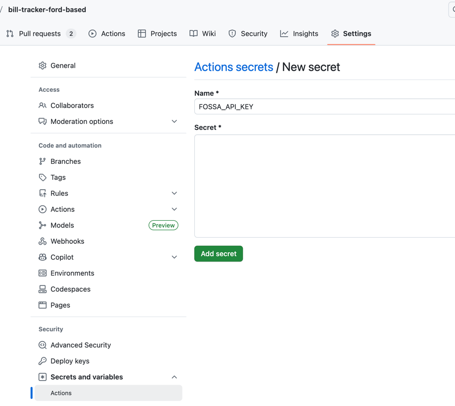

### 0.3.4 Overview


Goal: Automatically scan dependencies (licenses + known risks) on every PR / push, and upload results to FOSSA.

* FOSSA CLI v3
* a push-only token
* github actions now, and later we can translate the exact same steps to Tekton


## 0.3.4.1 Set up your FOSSA account and organization

### Step 1: Sign in and confirm you’re in the right place

1. Open FOSSA in your browser and sign in  
   (usually via GitHub / Google / email depending on your org setup)

2. Once signed in, look for:
    - Your avatar or email in the top right
    - Any **Organization** selector  
      (some tools show a dropdown if you belong to multiple orgs)

#### What you’re verifying

- You can actually reach the web app.
- You’re not stuck in a marketing page or a “pending invite” state.

#### Checkpoint test

- You can see a dashboard or main app navigation, not just docs/marketing.

---

### Step 2: Find “Organization Settings”

FOSSA docs describe creating tokens from **Organization Settings** and managing
users / teams / roles there.  
*(FOSSA Guides)*

#### Do this

1. Click your avatar/email (top right).
2. Choose something like:
    - **Settings**
    - **Organization Settings**
    - **Account Settings** (wording varies)

If you see multiple tabs/sections, look for:
- **Integrations**
- **Users**
- **Teams**
- **Roles**

Those are standard areas described in their docs.  
*(FOSSA Guides)*

---

#### Checkpoint test

- You can reach a page that clearly says **Organization Settings**
  (or equivalent) and shows settings categories like
  Users / Teams / Integrations.


### Step 3: Confirm (or create) your organization

Now we need to ensure you have the correct org context because later your scans
will land in that org.

#### If you already see an organization name

- Click into it and confirm it is the org you want for this project  
  (for personal projects it might be your name, for work it might be your company).
- If you belong to multiple orgs, switch to the one you want.

#### If you are prompted to create one

Create an org with:

- **Name**: something like `Sankofa` or `Altruistic Software Development`
- **Slug/key**: keep it short and stable  
  (this matters later for integrations)

#### Checkpoint test

- You can clearly see the organization name somewhere in the UI and you can
  navigate within it.

---

### Step 4: Confirm you have permission to create tokens

We need to make sure you can create API tokens later.  
FOSSA docs say tokens are created under  
**Organization Settings → Integrations → API (or API User)**, and tokens are shown
only once.  
*(FOSSA Guides)*

#### Do this

1. In **Organization Settings**, go to **Integrations**
2. Look for **API** or **API Tokens**

If you can see the API token page (even if you do not create one yet), you have
the permission level needed.

#### Checkpoint test

- You can navigate to an **API / API Tokens** section  
  (do **not** generate a token yet in 0.3.4.1).

---

### Step 5: Optional but recommended setup checks
*(avoid pain later)*

These reduce friction in later steps.

---

#### 5A) Confirm user email and profile

- Confirm the account email is correct and accessible.
- This prevents issues where GitHub Actions runs but you cannot access scans due
  to org membership mismatch.

---

#### 5B) Confirm GitHub integration option exists
*(do not configure yet)*

FOSSA supports GitHub integration via OAuth or GitHub App.  
*(FOSSA Guides)*

We are not doing this yet, but verify you can find **GitHub** in integrations later.

#### Checkpoint test

- You can find an integrations list that includes **GitHub**
  (or indicates GitHub can be connected).


### Final Alignment Test

1. ***Do you see "Organization Settings (or equivalent)" and you can open it?***
2. ***What is the organization name you see selected right now?***
3. ***Can you navigate to the integrations and see an API/API Tokens section?***

## 0.3.4.2 Create a FOSSA API token for CI (Push-Only)

### Why we’re doing this

Your CI pipeline needs a credential so it can **upload scan results to FOSSA**.
That credential should be:

- **Non-human**  
  (so it doesn’t break when a user leaves)
- **Least privilege**  
  (so if it leaks, damage is limited)
- **Easy to rotate**  
  (you can replace it without touching code)

FOSSA supports token-based auth for the CLI and recommends using tokens that are
appropriate for automation (**push-only where possible**).

---

### Step-by-step (click path)

---

### Step 1: Go to the API tokens page

You said you can already reach it, so do:

- **Organization Settings**
    - **Integrations**
        - **API** or **API Tokens**

*(Exact label varies, but you’re there.)*

---

### Step 2: Create a new token

Click something like:

- **Create token**
- **Generate token**
- **Add API key**

---

### Step 3: Name it like a CI credential

Use a name that tells you:

- what repo it’s for
- what it’s used for
- where it runs

#### Example name

- `bill-tracker-ford-based-github-actions`

If you plan to also run scans in Tekton later, you can create a second token later:

- `bill-tracker-ford-based-tekton`

---

### Step 4: Choose the safest permission level

If FOSSA offers a choice like:

- Push-only
- Full access
- Read/write

**Choose push-only.**

If FOSSA doesn't show a "push-only" option, choose the least privilege option.

### Step 5: Create and copy the token (one-time view)

When you generate the token, **copy it immediately**. You will not be able to see it again.
save it in a password manager or secure notes app.


## 0.3.4.3 Add the FOSSA token to GitHub Secrets

### What this step does (why it exists)

Your CI pipeline runs in **GitHub Actions**, not on your laptop.

So:

- The FOSSA CLI needs a token
- The token must be available **only at runtime**
- The token must **never live in the repo**

GitHub Secrets are the correct mechanism for this.  
This is the same pattern you already used successfully for **SonarCloud**.

---

### Step-by-step (no guessing)

---

### Step 1: Open your repository settings

In GitHub:

1. Go to your repository: `bill-tracker-ford-based`
2. Click **Settings**
3. In the left sidebar, click:
    - **Secrets and variables**
    - **Actions**

You should now see sections for:

- **Repository secrets**
- **Environment secrets** (ignore those for now)

---

### Step 2: Create the secret

1. Click **New repository secret**
2. Fill in exactly:
    - **Name**: `FOSSA_API_KEY`
    - **Value**: paste the token you just created in FOSSA
3. Click **Save**

---

### Important

- The name must be **exactly** `FOSSA_API_KEY`
- Case-sensitive
- No extra spaces

The FOSSA CLI automatically looks for this environment variable name.
We are intentionally aligning with the default to avoid extra configuration.
This is straight from FOSSA’s CLI behavior.




## 0.3.4.4 Install FOSSA CLI v3 in the pipeline (correctly)

### Why your old step failed

Your pipeline used the v1 installer (`install.sh`), which:

- installs deprecated CLI v1
- tries to write to `/usr/local/bin`
- can fail with permissions (`Operation not permitted`)

FOSSA recommends using the **install-latest** script for the current CLI (v3).

We will install into a **user-writable directory** and add it to `PATH`.

---

### Step-by-step change to `backend-ci.yml`

---

### Step 1: Replace your existing install step

Find your current step that looks like:

```yaml
- name: Install FOSSA CLI
  run: |
    curl -H 'Cache-Control: no-cache' https://raw.githubusercontent.com/fossas/fossa-cli/master/install.sh | bash
```

Replace it with:

```yaml
- name: Install FOSSA CLI (v3)
  run: |
    mkdir -p "$HOME/.local/bin"
    curl -H 'Cache-Control: no-cache' https://raw.githubusercontent.com/fossas/fossa-cli/master/install-latest.sh | bash
    echo "$HOME/.local/bin" >> $GITHUB_PATH
    fossa --version
```

### Step 2: Make sure this runs after checkout

the install step should come after:
* actions/checkout@v4

it can be before or after Java setup but I prefer:
1. checkout
2. set up-java
3. set up gradle
4. install FOSSA


### 0.3.4.5 Add the actual scan step (fossa analyze)

Once CLI installs, add this step:

```yaml
- name: FOSSA Analyze
  env:
    FOSSA_API_KEY: ${{ secrets.FOSSA_API_KEY }}
  run: |
    fossa analyze

```

FOSSA documents FOSSA_API_KEY=<token> fossa analyze as the standard CI invocation.
FOSSA - Guides & Documentation
+1

Monorepo note (important)

If your repo has backend/ and frontend/, you need to decide where to run fossa analyze:

If you want full repo scan (backend + frontend deps), run it from repo root

If you only want backend for now, run it from backend/

Strong opinion for your case: run it from repo root so you catch npm/pnpm deps later too.

So in YAML you can do:

```yaml
- name: FOSSA Analyze
  env:
    FOSSA_API_KEY: ${{ secrets.FOSSA_API_KEY }}
  run: |
    fossa analyze

```


(And do not set working-directory for that step, or set it explicitly to root.)

Checkpoint test

Actions should show:

Analyze completes

Results upload succeeds

## 0.3.4.6 – FOSSA Setup, Alignment, and Resolution (Summary)

This section documents the complete setup, debugging, and final alignment of FOSSA in the CI pipeline.

---

## Goal of This Slice

- Add **dependency and license scanning** to CI using FOSSA
- Ensure scans run automatically in GitHub Actions
- Avoid blocking development while still collecting compliance data
- Align on **one authoritative FOSSA project**

---

## What We Implemented

### 1. FOSSA Account & Org Setup
- Confirmed access to the FOSSA organization:
    - **Altruistic Software Development**
- Verified sufficient permissions to:
    - Create projects
    - Generate API tokens
    - View scan results

---

### 2. Created a CI-Scoped FOSSA API Token
- Generated a **non-human API token** for CI usage
- Used least-privilege permissions (push/upload only where possible)
- Stored the token securely in GitHub Secrets as:

```text
FOSSA_API_KEY
```
This token is only available at runtime and never committed to the repo.

---

## 3. Installed the Correct FOSSA CLI Version (v3)

### Problem Encountered

- Initial pipeline used `install.sh`, which installs deprecated FOSSA CLI v1
- v1 failed with:
    - Deprecation warnings
    - `/usr/local/bin` permission errors

---

### Resolution

- Switched to the **v3 installer** using `install-latest.sh`
- Installed into a **user-writable directory**
- Added it to `PATH` in GitHub Actions

---

### Final Install step

```yaml
- name: Install FOSSA CLI (v3)
  run: |
    mkdir -p "$HOME/.local/bin"
    curl -H 'Cache-Control: no-cache' https://raw.githubusercontent.com/fossas/fossa-cli/master/install-latest.sh \
      | bash -s -- -b "$HOME/.local/bin"
    echo "$HOME/.local/bin" >> $GITHUB_PATH
```

### Ran the First Successful FOSSA Scan
* Executed `fossa analyze` in the pipeline
* FOSSA auto-detected the gradle backend project
* Scan completed with:
  * 1 project scanned
  * 0 failures
  * 34 analyse issues that were all license-related
* 

### 5. Resolved the "Two Projects" Confusion in FOSSA

I created a fossa project on a previous run and the pipeline created another one.

1. bill-tracker-ford-based (created by me manually)
2. https://github.com/MrSankofa/bill-tracker-ford-based (created by pipeline)

At first glance, this looked like a mistake

Root cause (Confirmed via --debug):

running

```yaml
fossa analyze -debug
```

revealed:

```text
Using project name: http://github.com/MrSankofa/bill-tracker-ford-based
```

This confirmed:
* CI uploads were targeting the URL-named project
* The other project was unused and stale

### Resolution

* kept the url one
* deleted the unused one
* removed --debug once alignment was confirmed

### 6. Locked Down the Scan Location

To avoid accidental future drift, I made the backend scan explicit:

```yaml
- name: FOSSA Analyze (backend)
  env:
    FOSSA_API_KEY: ${{ secrets.FOSSA_API_KEY }}
  run: |
    fossa analyze
  working-directory: ./backend
```

## Current State

### ✅ What Is Working

- FOSSA CLI v3 installs cleanly in CI
- Scans run automatically on pushes / PRs
- Results upload to the correct FOSSA project
- CI remains green

---

### ⚠️ Known Findings

- **34 license issues**
- **0 critical or high vulnerabilities**

All issues are **license-related**, not security-related.

---

## Decision on License Issues

- We are intentionally running in **observe mode**
- No builds are blocked by license findings
- License issues will be triaged later once core features stabilize

This avoids premature compliance work while still collecting accurate data.

---

## Outcome of 0.3.4

By the end of this slice, we have:

- Dependency visibility
- License visibility
- CI-integrated scanning
- A single, authoritative FOSSA project
- No false failures or blocking noise

**0.3.4 is complete and stable.**


