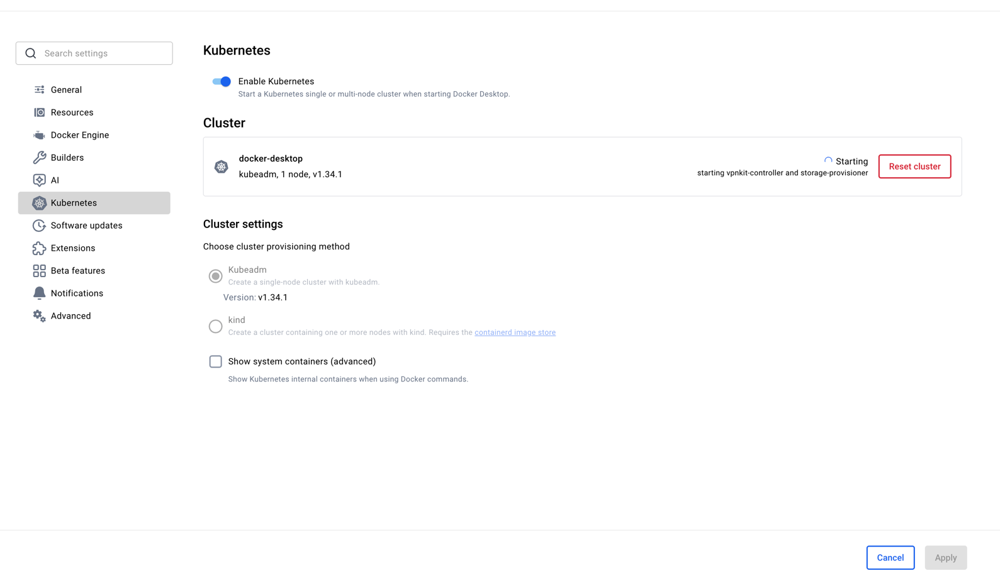

## 0.4.0 Setup Docker Desktop Kubernetes (baby steps)

### 0.4.0.1 Enable Kubernetes in Docker Desktop

1. Open Docker Desktop
2. Go to **Settings** (gear icon)
3. Find **Kubernetes**
4. Check **Enable Kubernetes**
5. Click **Apply & Restart**

---

### Alignment test

When it finishes, Docker Desktop should show Kubernetes status as **Running**.

Reply with:

- “Kubernetes enabled and running”

---

### 0.4.0.2 Verify kubectl is now wired

Run:

```shell
kubectl version --client
kubectl config get-contexts
kubectl config current-context
kubectl cluster-info
kubectl get nodes

```

### What “good” looks like

- `kubectl config get-contexts` shows at least one context, usually `docker-desktop`
- `kubectl get nodes` returns 1 node (your local cluster)

---

### Alignment test

Paste the output of:

- `kubectl config get-contexts`
- `kubectl get nodes`




### 0.4.0.3 Install Tekton Pipelines

#### Step 1: Install Tekton Pipelines CRDs

Run:

```shell
kubectl apply --filename https://storage.googleapis.com/tekton-releases/pipeline/latest/release.yaml
```
This installs Tekton Pipelines into the tekton-pipelines namespace.

#### Step 2: Verify Tekton Pipelines installation

Rune:

```shell
kubectl get pods --namespace tekton-pipelines --watch
```

Stop watching once the core pods show 1/1 READY, especially:
* tekton-pipelines-controller
* tekton-pipelines-webhook

Hit `CTRL+C` when they're stable.

### Alignment test

Run this command:

```shell
kubectl get pods --namespace tekton-pipelines
```

what we are looking for is that all the pods are in the `Running` state and have `1/1` in the `READY` column.
* tekton-pipelines-controller is `Running` with `1/1`
* tekton-pipelines-webhook is `Running` with `1/1`


### 0.4.1.1 Install Tekton CLI (tkn)

this is option, but it makes your life 10x easier for viewing logs and running TaskRuns.

Steps:

Run:

```shell
# MacOS with Homebrew
brew install tektoncd-cli
tkn version
```

if you do not want to install it, we can do everything with kubectl, but tkn is way easier.

## 0.4.1 Run `./gradlew test` in Tekton using kubectl only

### Goal of this slice

Prove that Tekton can:

- clone your repo
- mount a shared workspace
- run Java 21
- execute `./gradlew test` in `backend/`
- and give you logs you can debug with `kubectl`

No CI parity yet. Just correctness.

---

### 0.4.1.2 Check for `git-clone` Task

Tekton does not ship with catalog tasks by default.
Some environments preinstall them, some don’t.

Run:

```shell
kubectl get tasks.tekton.dev -A
```

What are we looking for?
* Do you see a task named `git-clone` in the output?


Why this matters:

Tekton philosophy is to have small, single-purpose tasks that can be composed into larger workflows.

* Pipelines orchestrate tasks.
* Tasks do one thing well.
* Catalog tasks are reusable tasks that can be shared across pipelines.
if `git-clone` is not present, we will need to install it from the Tekton Catalog.


### 0.4.1.3 Install `git-clone` Task (if needed)

#### Step 1: Install the Task into your cluster

What is a cluster?
A Kubernetes cluster is a set of nodes (machines) that run containerized applications managed by Kubernetes.

Run:

```shell
kubectl apply -f https://raw.githubusercontent.com/tektoncd/catalog/main/task/git-clone/0.10/git-clone.yaml
```
This command fetches the `git-clone` Task definition from the Tekton Catalog and applies it to your Kubernetes cluster.

(Version numbers can change over time; we're usign a stable catalog version here.)

#### Step 2: Verify installation

Run:

```shell
kubectl get tasks.tekton.dev -A | grep git-clone
```

### Alignment test

once we see git-cline, we'll create:

* a Task called gradle-test-backend (java 21 image)
* a Task Run That:
  * clones your repo
  * runs ./gradlew test in backend/
  * stores work in a shared workspace

and this guide will show exactly how to pull logs with
* kubectl get taskrun
* kubectl describe taskrun
* kubectl get pods
* kubectl logs <pod> -c step-<step-name>
* kubectl logs taskrun/<name> -c step-<step-name>


### 0.4.1.4 Create a workspace PVC

Steps:

Run:

```shell
kubectl apply -f - <<'YAML'
apiVersion: v1
kind: PersistentVolumeClaim
metadata:
  name: bill-tracker-workspace-pvc
spec:
  accessModes:
    - ReadWriteOnce
  resources:
    requests:
      storage: 2Gi
YAML

```

What is PVC?
A PersistentVolumeClaim (PVC) is a request for storage by a user in Kubernetes.

What is a workspace PVC?
In Tekton, a workspace PVC is used to share data between different tasks in a pipeline.

what is kubectl apply -f - <<'YAML'?
This command allows you to create Kubernetes resources directly from the command line using a "here document" (heredoc) syntax.

Why is YAML at the start/end? Is that a mistake?
No, it's not a mistake. The `<<'YAML'` syntax indicates the start
The `YAML` at the end indicates the end of the heredoc input. Everything between

### Alignment test
Run:

```shell
kubectl get pvc bill-tracker-workspace-pvc
```
You should see the PVC listed with a status of `Bound`, indicating that it has been successfully created and is ready for use.

* Status should become `Bound` after a few seconds.
once it's `Bound`, we can use it in our TaskRun to share data between tasks.


I need to take a step back and ask why are we doing this?

### Why we're doing this
Why are we creating a PVC for the workspace?
In Tekton, tasks often need to share data, such as source code or build artifacts.
A PersistentVolumeClaim (PVC) provides a way to create a shared storage space that multiple tasks
can access.
By creating a PVC for the workspace, we ensure that the data produced by one task (like cloning the repo)
can be accessed by subsequent tasks (like running tests).
This is especially important in a CI/CD pipeline where tasks are often executed in isolated environments.

In Tekton:
* workspaces are how tasks share files
* cloning the repo and running Gradle must happen in the same workspace
* using a PVC makes it explicit and debuggable, which matches real enterprise clusters
* using a PVC prepares us for future steps where we might want to persist build artifacts or logs beyond the lifecycle of individual tasks

---


### 0.4.1.5 Create and run the pipeline run

Why are we doing this?
A PipelineRun in Tekton is a way to execute a defined pipeline.
It specifies the parameters, resources, and workspaces that the pipeline will use during its execution.

Step 1: Apply this PipelineRun definition (anonymous clone attempt)

replace `<your-git-repo-url>` with your actual Git repository URL.

Example https://github/.com/MrSankofa/bill-tracker-ford-based.git
https://github.com/MrSankofa/bill-tracker-ford-based.git
Run:

```shell
kubectl create -f - <<'YAML'
apiVersion: tekton.dev/v1
kind: PipelineRun
metadata:
  generateName: bill-tracker-backend-test-
spec:
  pipelineSpec:
    workspaces:
      - name: shared-workspace
    tasks:
      - name: clone
        taskRef:
          name: git-clone
        workspaces:
          - name: output
            workspace: shared-workspace
        params:
          - name: url
            value: REPO_URL_HERE
          - name: revision
            value: main
          - name: deleteExisting
            value: "true"

      - name: gradle-test
        runAfter: ["clone"]
        workspaces:
          - name: source
            workspace: shared-workspace
        taskSpec:
          workspaces:
            - name: source
          steps:
            - name: test
              image: eclipse-temurin:21-jdk
              workingDir: $(workspaces.source.path)/backend
              script: |
                #!/usr/bin/env bash
                set -euo pipefail
                chmod +x ./gradlew
                ./gradlew clean test
  workspaces:
    - name: shared-workspace
      persistentVolumeClaim:
        claimName: bill-tracker-workspace-pvc
YAML


```

Step 2: Monitor the PipelineRun

Run:

```shell
kubectl get pipelinerun -w
```

When you see the bill-tracker-backend-test-xxxxx PipelineRun appear, note its name.
Stop watching with `CTRL+C`.

How do you know all the code to write in that last run?
The code for the PipelineRun is designed to achieve the following objectives:
1. Clone the Git Repository:
   - The first task in the pipeline is named `clone`, which uses the `git-clone` task from the Tekton Catalog.
   - It clones the specified Git repository (replace `REPO_URL_HERE` with your actual repo URL) into a shared workspace.
   - The `revision` parameter is set to `main`, indicating that it will clone the main branch of the repository.
   - The `deleteExisting` parameter is set to `"true"` to ensure that any existing content in the workspace is removed before cloning.
2. Run Gradle Tests:
   - The second task is named `gradle-test`, which runs after the `clone` task.
   - It uses a custom task specification (`taskSpec`) to define the steps needed to run the Gradle tests.
   - The task uses the `eclipse-temurin:21-jdk` Docker image, which includes Java 21, suitable for running Gradle.
   - The working directory is set to the `backend` folder within the cloned repository.
   - The script step makes the `gradlew` script executable and then runs `./gradlew clean test` to execute
   - the tests.
3. Shared Workspace:
   - Both tasks share a workspace named `shared-workspace`, which is backed by the previously created PVC (`bill-tracker-workspace-pvc`).
   - This allows the `gradle-test` task to access the code cloned by the `clone` task.
4. PipelineRun Metadata:
   - The `metadata` section uses `generateName` to create a unique name for each PipelineRun instance, making it easy to identify and manage multiple runs.
   - The `spec` section defines the overall structure of the pipeline, including the tasks and workspaces.
   - This structure ensures that the pipeline can be executed in a Kubernetes environment with Tekton installed.
   - By following this structure, the PipelineRun effectively orchestrates the process of cloning a Git repository and running Gradle tests in a clear and organized manner.
   - This approach leverages Tekton's capabilities to create reusable and composable tasks, making it easier to manage CI/CD workflows.


Why about the format of apiVersion, kind, metadata, spec, etc.?
The format of `apiVersion`, `kind`, `metadata`, and `spec` follows the
Kubernetes resource definition conventions.
These conventions are used to define custom resources in Kubernetes,
including Tekton resources like PipelineRun.
Here's a brief explanation of each component:
- `apiVersion`: Specifies the version of the API that the resource belongs to.
- `kind`: Indicates the type of resource being defined (e.g., PipelineRun, Task, Pod).
- `metadata`: Contains metadata about the resource, such as its name, namespace, labels, and annotations.
- `spec`: Defines the desired state of the resource, including its configuration and behavior.
These components are essential for Kubernetes to understand and manage the resources correctly.

Is there a cheatsheet I can reference to help me write these yaml files?
Yes, the official Tekton documentation provides a comprehensive reference for writing YAML files for Tekton resources
, including PipelineRun, Task, and Pipeline definitions.
You can find it here: https://tekton.dev/docs/

Here's a brief cheatsheet for writing Tekton YAML files:
```yaml
apiVersion: tekton.dev/v1beta1  # Specify the API version
kind: PipelineRun               # Specify the kind of resource
metadata:                       # Metadata about the resource
  name: my-pipelinerun          # Name of the PipelineRun
spec:                           # Specification of the resource
  pipelineRef:                  # Reference to the Pipeline
    name: my-pipeline           # Name of the Pipeline to run
  workspaces:                   # Define workspaces
    - name: my-workspace
      persistentVolumeClaim:     # Use a PVC for the workspace
        claimName: my-pvc
  params:                       # Define parameters for the Pipeline
    - name: param1
      value: value1
  serviceAccountName: my-sa     # Specify the ServiceAccount to use
```
This cheatsheet provides a basic structure for a Tekton PipelineRun YAML file. You can expand upon it by adding tasks, steps, and other configurations as needed for your specific use case.    


### Alignment test

Run:

```shell
kubectl get pipelinerun
```
You should see a PipelineRun with a name starting with `bill-tracker-backend-test-` and its status should be `Running` or `Succeeded` depending on whether it has completed yet.

It should fail the first time if your repo URL is incorrect or if there are issues with the Gradle build.
But here is how to debug it in the next step.

### 0.4.1.5 Debugging and Fixing 0.4.1.5 Step 1

#### Step 1: Get the PipelineRun name | Get the pod details (fastest clue)

Run:

```shell
kubectl describe pod bill-tracker-backend-test-xxxxx-podname
```

Scroll to the bottom to see the events and status of each step.
* any messages about auth, repo not found, or SSL

#### Step 2: Get logs from the step container

tekton pods have multiple containers, one per step. We need to get logs from the right one.

1. List containers in the pod:

```shell
kubectl get pod bill-tracker-backend-test-nbtrn-clone-pod -o jsonpath='{.spec.containers[*].name}{"\n"}'
```

What is this doing?
This command retrieves the names of all containers within the specified pod using `kubectl` and formats
the output to display each container name on a new line.

2. Then pull logs from the container that looks like it contains "clone" (often step-clone):

```shell
kubectl logs bill-tracker-backend-test-nbtrn-clone-pod -c step-clone
``` 

if the container name isn't step-clone, replace it with the correct one from step 1.

### Alignment test

Check the last ~20 lines of the logs for errors related to cloning the repo.
if you see errors like "repository not found" or "authentication failed", double-check your Git repo URL and credentials.

Look closely at the error messages in the logs.
* You intended: https://github.com/MrSankofa/bill-tracker-ford-based.git
* But you wrote: REPO_URL_HERE 
* That causes: Could not resolve host: REPO_URL_HERE

In your pipelineRun definition, replace `REPO_URL_HERE` with your actual Git repository URL.


### 0.4.1.7 Rerun with corrected URL

Since pipelineRuns are immutable-ish, and you used kubectl create -f - to create it,
the easiest approach is: create a new pipelineRun with the corrected URL.

Run:

```shell
kubectl create -f - <<'YAML'
apiVersion: tekton.dev/v1
kind: PipelineRun
metadata:
  generateName: bill-tracker-backend-test-
spec:
  pipelineSpec:
    workspaces:
      - name: shared-workspace
    tasks:
      - name: clone
        taskRef:
          name: git-clone
        workspaces:
          - name: output
            workspace: shared-workspace
        params:
          - name: url
            value: https://github.com/MrSankofa/bill-tracker-ford-based.git
          - name: revision
            value: main
          - name: deleteExisting
            value: "true"

      - name: gradle-test
        runAfter: ["clone"]
        workspaces:
          - name: source
            workspace: shared-workspace
        taskSpec:
          workspaces:
            - name: source
          steps:
            - name: test
              image: eclipse-temurin:21-jdk
              workingDir: $(workspaces.source.path)/backend
              script: |
                #!/usr/bin/env bash
                set -euo pipefail
                chmod +x ./gradlew
                ./gradlew clean test
  workspaces:
    - name: shared-workspace
      persistentVolumeClaim:
        claimName: bill-tracker-workspace-pvc
YAML
```

### Alignment test

1. Run:

```shell
kubectl get pipelinerun
```

2. find the newest bill-tracker-backend-test-xxxxx PipelineRun
3. then list pods:

```shell
kubectl get pods
```

### 0.4.1.8 Pull logs from the gradle-test step (Kubectl way)

#### Step 1: List containers in the gradle test pod

Run:

```shell
kubectl get pod bill-tracker-backend-test-xxxxx-podname -o jsonpath='{.spec.containers[*].name}{"\n"}'
```

What is this doing?
This command retrieves the names of all containers within the specified pod using `kubectl` and formats
the output to display each container name on a new line.

#### Step 2: Get logs from the gradle step container

if the container is step-test, run:

```shell
kubectl logs bill-tracker-backend-test-xxxxx-podname -c step-test
```

if the container name isn't step-test, replace it with the correct one from step 1.

### Alignment test

Check the last ~30 lines of the logs, especially looking for:
* BUILD SUCCESSFUL or any test failures


It should fail because at this point we are using TestContainers, which requires Docker to be running inside the Tekton pod.

### Fixing it

We're currently on Docker Desktop Kubernetes and we want a path that translate to work
(openshift, gke, aks, eks, etc) without docker-in-docker complexity.

Use "real Postgress as a service" for tekton tests not TestContainers.

In Cluster CI, the common pattern is:
* spin up Postgres as a separate Kubernetes resource (Deployment + Service)
* point Spring tests at it with a test profile
* keep testcontainers for local dev only or specialized integration tests
This also avoids privileged access to Docker in CI, which OpenShift often restricts.


So next:
1. deploy Postgress pod + service to Docker Desktop Kubernetes
2. run tests with ```SPRING_PROFILES_ACTIVE=test```
3. use ```application-test.properties``` that points to that postgress service
4. ensure Liquibase runs against that service

### 0.4.1.9 Fix: Add a postgres service inside the cluster

Step 1: Create Postgres Deployment + Service

Run:

```shell
kubectl apply -f - <<'YAML'
apiVersion: v1
kind: Secret
metadata:
  name: bill-tracker-postgres-secret
type: Opaque
stringData:
  POSTGRES_DB: bill_tracker
  POSTGRES_USER: billtracker
  POSTGRES_PASSWORD: billtracker
---
apiVersion: apps/v1
kind: Deployment
metadata:
  name: bill-tracker-postgres
spec:
  replicas: 1
  selector:
    matchLabels:
      app: bill-tracker-postgres
  template:
    metadata:
      labels:
        app: bill-tracker-postgres
    spec:
      containers:
        - name: postgres
          image: postgres:16-alpine
          ports:
            - containerPort: 5432
          envFrom:
            - secretRef:
                name: bill-tracker-postgres-secret
---
apiVersion: v1
kind: Service
metadata:
  name: bill-tracker-postgres
spec:
  selector:
    app: bill-tracker-postgres
  ports:
    - name: postgres
      port: 5432
      targetPort: 5432
YAML
```

what are we doing here?
This YAML manifest creates three Kubernetes resources:
1. A Secret named `bill-tracker-postgres-secret` that stores the database name, username, and password for the PostgreSQL database.
2. A Deployment named `bill-tracker-postgres` that runs a single replica of a PostgreSQL container using the `postgres:16-alpine` image.
   The container is configured to use the environment variables defined in the Secret for database configuration.
3. A Service named `bill-tracker-postgres` that exposes the PostgreSQL Deployment on port 5432, allowing other pods in the cluster to connect to the database using this service.

This setup provides a simple PostgreSQL database instance running inside the Kubernetes cluster, which can be accessed by other applications or services within the same cluster.

What are the replicas for?
In Kubernetes, the `replicas` field in a Deployment specification defines the desired number of pods that should be running for that Deployment.
By setting `replicas: 1`, we are instructing Kubernetes to maintain exactly one instance of the PostgreSQL pod at all times.
If the pod crashes or is deleted, Kubernetes will automatically create a new pod to replace it, ensuring that there is always one running instance of the PostgreSQL database.  


Step 2: Wait for the Postgres pod to be running

Run:

```shell
kubectl rollout status deployment/bill-tracker-postgres
kubectl get pods | grep bill-tracker-postgres
```
You should see the Postgres pod with a status of `Running` and `1/1` in the READY column.


### 0.4.1.10 Switch Tests to a cluster-backed DB (Tekton-safe)

What are we doing here and why?

In this step, we are modifying the Tekton PipelineRun definition to run the Gradle tests with a Spring profile that points to the PostgreSQL database running inside the Kubernetes cluster.
This is necessary because TestContainers, which is commonly used for local development, requires Docker to be running inside the Tekton pod.
By using a real PostgreSQL service within the cluster, we can avoid the complexities of Docker-in-Docker setups and ensure that our tests can run successfully in the Tekton environment.

We currently have two kinds of tests mixed together:

1. Context + wiring tests that just need a database connection
2. Infrastructure tests (integration test) that spin up Docker Containers (TestContainers)

In CI-on-Kubernetes:

* Docker is often not available or restricted
* TestContainers can be flaky or fail due to lack of Docker access
* Using a real database service is more reliable and mirrors production more closely

So:

* Tekton tests will use Spring profile ```test```
* ```application-test.properties``` will point to ```bill-tracker-postgres```
* Liquibase will run normally
* Testcontainers-based tests will be skipped in Tekton

### Step 1: Create `application-test.properties`

Create this file in `backend/src/main/resources/application-test.properties`:

```properties
spring.datasource.url=jdbc:postgresql://bill-tracker-postgres:5432/bill_tracker
spring.datasource.username=billtracker
spring.datasource.password=billtracker
spring.datasource.driver-class-name=org.postgresql.Driver

spring.jpa.hibernate.ddl-auto=none
spring.jpa.show-sql=false

spring.liquibase.enabled=true
spring.liquibase.change-log=classpath:db/changelog/db.changelog-master.yaml
```

this does three critical things:
1. Points Spring to the in-cluster Postgres service
2. Ensures Liquibase runs against that database
3. Disables Hibernate auto-ddl to avoid conflicts with Liquibase

### Step 2: Exclude TestContainers tests in Tekton

Annotate TestContainers-based tests with:

```java
@Tag("testcontainers")
class LiquibaseWiringTest {
   // ...
}
```

Then, in the Tekton PipelineRun, modify the Gradle command to exclude that tag:

```bash./gradlew clean test -Dspring.profiles.active=test -DexcludeTags=testcontainers
```

or

### Step 3: Update the Tekton Gradle Step
Change the gradle command in the PipelineRun definition to:

```shell
./gradlew clean test \
  -Dspring.profiles.active=test \
  -Dgroups=!testcontainers
```

what is the difference between -DexcludeTags and -Dgroups?
`-DexcludeTags` is used to exclude tests based on their tags, while 
`-Dgroups` is used to include or exclude tests based on their groups.

In this case, we are using `-Dgroups=!testcontainers` to exclude tests that are tagged with `testcontainers`.

Updated step snippet:

```yaml
script: |
  #!/usr/bin/env bash
  set -euo pipefail
  chmod +x ./gradlew
  ./gradlew clean test \
    -Dspring.profiles.active=test \
    -Dgroups=!testcontainers
```

### Step 4: Re-run the PipelineRun
Create a new PipelineRun (Same YAML as before, just updated gradle command):

then monitor it:

```shell
kubectl get pods
kubectl logs <gradle-test-pod-name> -c step-test
```

SHow me what the full PipelineRun yaml looks like with these changes
Here is the updated PipelineRun YAML with the changes to use the `test` Spring profile and exclude TestContainers-based tests:

```shell
kubectl create -f - <<'YAML'
apiVersion: tekton.dev/v1
kind: PipelineRun
metadata:
  generateName: bill-tracker-backend-test-
spec:
  pipelineSpec:
    workspaces:
      - name: shared-workspace
    tasks:
      - name: clone
        taskRef:
          name: git-clone
        workspaces:
          - name: output
            workspace: shared-workspace
        params:
          - name: url
            value: https://github.com/MrSankofa/bill-tracker-ford-based.git
          - name: revision
            value: main
          - name: deleteExisting
            value: "true"

      - name: gradle-test
        runAfter: ["clone"]
        workspaces:
          - name: source
            workspace: shared-workspace
        taskSpec:
          workspaces:
            - name: source
          steps:
            - name: test
              image: eclipse-temurin:21-jdk
              workingDir: $(workspaces.source.path)/backend
              script: |
                #!/usr/bin/env bash
                set -euo pipefail
                chmod +x ./gradlew
                ./gradlew clean test \
                  -Dspring.profiles.active=test \
                  -Dgroups=!testcontainers
  workspaces:
    - name: shared-workspace
      persistentVolumeClaim:
        claimName: bill-tracker-workspace-pvc
YAML
```

Does this look correct?
Yes, the updated PipelineRun YAML looks correct. It includes the necessary changes to run the Gradle tests with the `test` Spring profile and excludes tests tagged with `testcontainers`.
